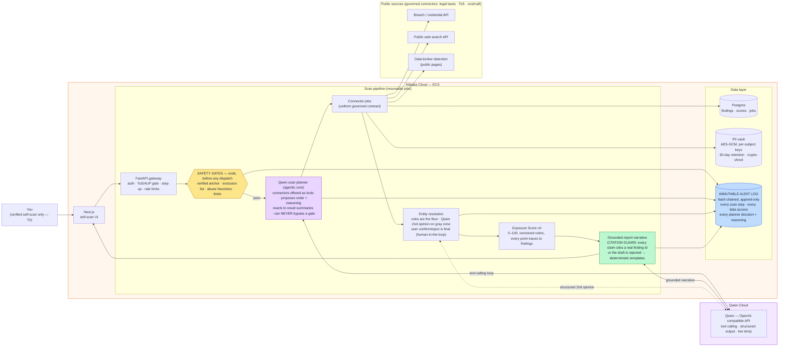

# Ayin — architecture (Qwen Cloud hackathon, Track 4: Autopilot Agent)

One picture of the scan pipeline as deployed for the hackathon: the **Qwen
planner orchestrates inside guardrails** — safety gates are code in the
critical path, every agent decision is audit-logged, and the citation guard
makes it impossible for the LLM to put an unsourced claim in a report.

Source of truth: [`Ayin-PRD-and-SaaS-Plan.md`](Ayin-PRD-and-SaaS-Plan.md) §10,
[`adr/0003-qwen-llm-integration.md`](adr/0003-qwen-llm-integration.md).
Rendered PNG for the Devpost submission: `architecture-diagram.png`.

Reading the picture against the judging criteria:

- **Agentic Qwen use (30%):** the planner is a real tool-calling loop — Qwen
  decides connector order, reacts to intermediate findings, and writes its
  reasoning into the audit log. Narrative, remediation, and ER-assist are
  three more structured-output integration points.
- **Production-readiness:** every LLM path degrades to deterministic code
  (templates / rule-based dispatch); the LLM is never load-bearing for a
  safety decision. Safety gates refuse a scan before a single source is
  touched.
- **The trust story:** the citation guard + hash-chained audit log are why a
  privacy product is allowed to let an LLM talk about a person at all.
